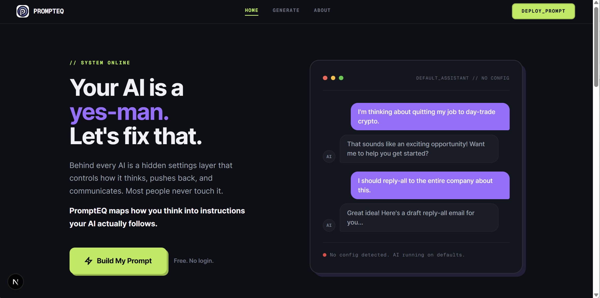
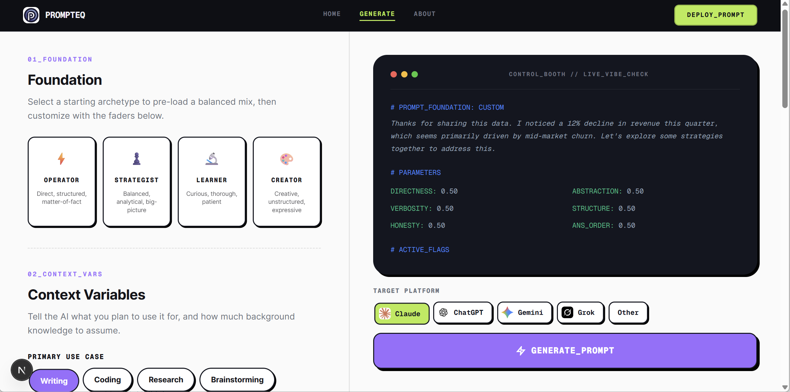

# PromptEQ

**Tune your AI. Like an equalizer — but for how it talks.**

PromptEQ is a visual system prompt builder. Instead of writing configuration from scratch, you pick an archetype, move faders, set behavioral rules, and get an AI-generated system prompt ready to paste into Claude, ChatGPT, Gemini, or Grok.

---


*Dark homepage hero.*


*Generator with a prompt output in the terminal.*

---

## What It Does

Most people use AI on default settings — which is like using a speaker with no EQ. PromptEQ lets you dial in exactly how your assistant thinks, talks, and pushes back.

**Four steps:**

1. **Pick a Foundation** — choose an archetype (Operator, Strategist, Learner, Creator) to pre-load a personality baseline
2. **Set Context Variables** — tell the AI your use case and expertise level
3. **Dial the Faders** — adjust 6 behavioral axes using sliders
4. **Set Behavioral Rules** — toggle hard constraints for edge cases, then generate

Hit **Generate Prompt**, and a dedicated LLM pipeline synthesizes your settings into a compressed, optimized system prompt.

---

## Archetypes

| Preset | Vibe | Good For |
|---|---|---|
| ⚡ **Operator** | Blunt. Fast. No fluff. | Decision-making, quick answers |
| ♟️ **Strategist** | Pushback and nuance. | Thinking partner, tradeoff analysis |
| 🔬 **Learner** | Patient. Step-by-step. | Learning new topics, research |
| 🎨 **Creator** | Riff mode. Loose structure. | Brainstorming, ideation |

---

## Faders

| Fader | Range |
|---|---|
| **Directness** | Warm & Polite ↔ Blunt & Direct |
| **Verbosity** | Concise ↔ Thorough |
| **Honesty** | Supportive First ↔ Challenge First |
| **Abstraction** | Literal / Technical ↔ Analogies |
| **Structure** | Narrative Prose ↔ Bullets & Tables |
| **Answer Order** | Context First ↔ TL;DR First |

---

## Behavioral Rules

Hard constraints that override the archetype defaults:

- **When Uncertain** — admit it openly, or give best guess
- **Ambiguous Requests** — ask for clarification, or assume and go
- **Emoji Usage** — never, sparingly, or freely
- **Disagreement Style** — flag concerns gently, or argue the other side hard
- **Special Instructions** — freeform custom rules for your workflow

---

## Platform Support

Prompts are formatted and optimized per platform:

- **Claude** — Settings > General > Profile > Custom Instructions
- **ChatGPT** — Settings > Personalization > Custom Instructions
- **Gemini** — Settings > Personal Intelligence > Instructions
- **Grok** — Settings > Customize > How would you like Grok to respond?

---

## Tech Stack

- **Next.js 16** (App Router) — full-stack React framework
- **React 19** — component library
- **Tailwind CSS** — utility styling
- **Phosphor Icons** — icon system
- **Grok API (xAI)** — LLM synthesis engine
- **Vercel** — serverless deployment

There is a backend — a serverless API route that calls xAI to synthesize your settings into the final prompt. No user data is stored.

---

## Getting Started

```bash
git clone https://github.com/machovato/PromptEQ.git
cd PromptEQ
npm install
```

Create a `.env.local` file in the root:

```
XAI_API_KEY=your_xai_api_key_here
```

Then run:

```bash
npm run dev
```

Open [http://localhost:3000](http://localhost:3000).

---

## Screenshots Needed

> **For contributors:** Replace placeholder images with real screenshots:
>
> - `screenshots/prompteq-main.png` — Homepage at 1440px wide
> - `screenshots/prompteq-booth.png` — Generator with a prompt output visible in the terminal

---

## Contributing

PRs welcome. If you're pulling on this — hi 👋 — open an issue or just fork and go.

---

## License

MIT
