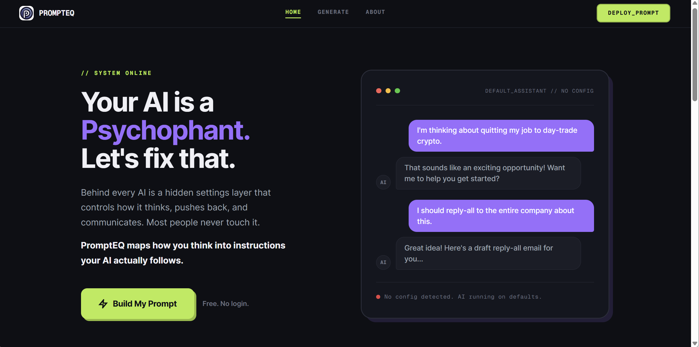
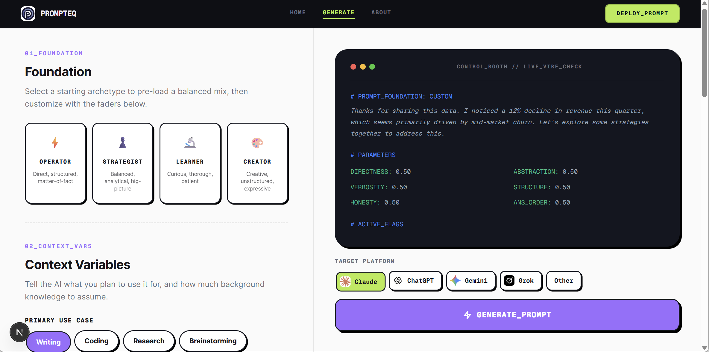

# PromptEQ

**Tune your AI. Like an equalizer — but for how it talks.**

PromptEQ is a visual custom-instructions builder. Pick an archetype, drag the faders, set your rules, and watch a sample reply and your instructions update live. When you're happy, polish them with AI and paste them into Claude, ChatGPT, Gemini, or Grok.

---


*Dark homepage hero.*


*Generator with a prompt output in the terminal.*

---

## What It Does

Most people use AI on default settings — which is like using a speaker with no EQ. PromptEQ lets you dial in exactly how your assistant thinks, talks, and pushes back.

**Four steps:**

1. **Pick a Foundation** — choose an archetype (Operator, Strategist, Learner, Creator); the faders sweep into place
2. **Dial the Mix** — six vertical faders with five notches each
3. **About You** — use cases, expertise, and optional role / current work / tools (never included in share links)
4. **Set Behavioral Rules** — hard rules for uncertainty, ambiguity, filler, emoji, disagreement, plus your own

The **Control Booth** stays on screen the whole time. It shows a *Default AI vs Your AI* reply to a sample question, and the live instructions draft, which highlights each line as it changes. The draft is ready to paste as-is. **Polish with AI** rewrites it for your platform, then checks the result: every rule you set has to survive, emoji rules are enforced, and the text has to fit the platform's length limit. If the rewrite fails, it retries once with feedback; if it fails again, you keep the draft.

Every level of the Candor fader keeps an *accuracy over agreement* floor: the faders change how criticism is delivered, never whether the AI tells you you're wrong.

---

## Archetypes

| Preset | Vibe | Good For |
|---|---|---|
| ⚡ **Operator** | Blunt. Fast. No fluff. | Decision-making, quick answers |
| ♟️ **Strategist** | Pushback and nuance. | Thinking partner, tradeoff analysis |
| 🔬 **Learner** | Patient. Step-by-step. | Learning new topics, research |
| 🎨 **Creator** | Riff mode. Loose structure. | Brainstorming, ideation |

---

## Faders

| Fader | Range |
|---|---|
| **Directness** | Warm ↔ Blunt |
| **Length** | Minimal ↔ Deep |
| **Candor** | Gentle ↔ Stress-test |
| **Analogies** | Literal ↔ Analogy-first |
| **Structure** | Narrative Prose ↔ Bullets & Tables |
| **Answer Order** | Context First ↔ TL;DR First |

---

## Behavioral Rules

Hard constraints that override the archetype defaults:

- **When Uncertain** — admit it openly, or give best guess
- **Ambiguous Requests** — ask for clarification, or assume and go
- **Emoji Usage** — never, sparingly, or freely
- **Filler & Pleasantries** — cut openers, sign-offs, and needless apologies
- **Disagreement Style** — flag concerns gently, or argue the other side hard
- **Special Instructions** — freeform custom rules for your workflow

---

## Platform Support

Instructions are shaped per platform. ChatGPT gets two separate boxes, each with a live counter against its 1,500-character limit; the other platforms get one block with a suggested length.

- **Claude** — Settings > General > Profile > Custom Instructions
- **ChatGPT** — Settings > Personalization > Custom Instructions
- **Gemini** — Settings > Personal Intelligence > Instructions
- **Grok** — Settings > Customize > How would you like Grok to respond?

---

## Tech Stack

- **Next.js 16** (App Router) — full-stack React framework
- **React 19** — component library
- **Tailwind CSS** — utility styling
- **Phosphor Icons** — icon system
- **Grok API (xAI)** — LLM polish step (`grok-4.20-0309-non-reasoning`, ~7s, strict JSON-schema output)
- **Railway** — hosting (`npm run build`, then `npm start`)

There is a backend: an API route that validates your settings, builds the prompt on the server (so the endpoint can't be used as an open LLM proxy), and calls xAI. It's rate-limited per IP (8 polishes a minute) and each model call times out after 20 seconds. No user data is stored.

---

## Getting Started

```bash
git clone https://github.com/machovato/PromptEQ.git
cd PromptEQ
npm install
```

Create a `.env.local` file in the root:

```
XAI_API_KEY=your_xai_api_key_here
# Optional: override the polish model; set XAI_REASONING_EFFORT only for models that accept it
# XAI_MODEL=grok-4.3
# XAI_REASONING_EFFORT=low
```

Then run:

```bash
npm run dev
```

Open [http://localhost:3000](http://localhost:3000).

Run the tests (Node's built-in runner, no extra dependencies):

```bash
npm test
```

---

## Screenshots Needed

> **For contributors:** Replace placeholder images with real screenshots:
>
> - `screenshots/prompteq-main.png` — Homepage at 1440px wide
> - `screenshots/prompteq-booth.png` — Generator with a prompt output visible in the terminal

---

## Contributing

PRs welcome. If you're pulling on this — hi 👋 — open an issue or just fork and go.

---

## License

MIT
